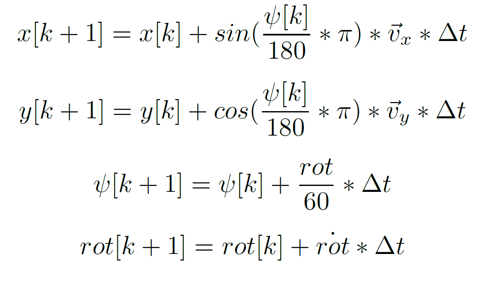

# VesselMPC
Model predictive controller (MPC) to guide a vessel according a path for the master thesis of autonomous navigation of inland vessels.
MPC basically simulates virtual vessels and gives each virtual vessel a different input. At the end of the simulations the input of the best performing vessel gets taken and fed into the real vessel after which the process is repeated. In the proposed MPC three different models can be used, two of them are obtained using neural networks.

# Vessel simulator
To test out the proposed MPC a vessel simulator was constructed. The simulator is based on basic equations from physics and can be seen in the picture below.

Take note that all the physics of the vessel can be abstracted to the rotdot parameter in the equations. This is the first deravitive of the Rate-of-Turn (ROT) and describes how was the ROT of the vessel can change in time.
The equations do not have any notion of external disturbance such as win and water streams.
A first implementation of noisy behaviour was achieved by adding random non-correlated noise to the simulation values, experiments also showed that the MPC is able to handle some level of noise.

# Path planning
To let a vessel follow a predefined path, that path has to be constructed first. In this Proof of Concept (PoC) a cubic hermite spline interpolation (CHSI) is used to construct a C1 continuous path through the way points.

# MPC strategy
To limit the amount of different possibles inputs, it was chosen to work with a relative ROT instead of an absolute ROT. Thus each control action exists of either increasing, decreasing or keeping the ROT at the same value. To further minimize the computational effort needed to evaluate the simulations, it was chosen to optimize three parameters: ROT1, ROT2 and transition time. The meaning of the parameters is pretty straightforward: ROT1 is the first ROT that gets send in to the vessel for the duration of the transition time. After the transition time has elapsed ROT2 will be send in. 
An illustrative example would be ROT1 = increase with 10 degrees, ROT2 = decrease with 10 degrees and transition time = 60sec. Thus the first 60sec the simulated vessel would increase its ROT with 10 degrees, if it had a ROT of 50 degrees it would now have Requested ROT (RROT) of 60 degrees for 60 sec. After the 60 secs the RROT would be 50 degrees. In the figure below an illustration of the strategy is shown.

# Models
As been described in the paper and the ModelTraining repository, there are three models that are used in the proposed MPC, two of them are based on neural networks. The first model is the same mathematical model that is used in the vessel simulator. To use this model the method 'optimize_simple()' can be used.
The second model is the black box model, the method for this model is optimize_simple_MLP_batch(). The third model is the rotdot model, the method that corresponds to this model is optimize_simple_MLP_rotdot_batch().
Both the black box model and the rotdot model have non batch methods aswell. These methods do work but have a way poorer performance since the data is not batched and each sample is send one after another into the neural network.
To interchange between the rotdot and the blackbox model the rotdot boolean in MPC.py should be changed accordingly.

# Initiliasing the MPC
As been described before in the ModelTraining repository, it is of great importance to normalise the data with the same normalisation factor that was used to train the model. To achieve this, the trainingsdata is imported into the mpc and the normalisation factors are calculated. This is done by using the MinMaxScaler fit_transform method from the sklearn library.

# Tuning parameters
## prediction horizon
The prediction horizon of the MPC tells how far the MPC will 'look into the future'. The greater the prediction horizon, the more computation power is necessary.
This parameter can be changed in MPC.py
## Cost function
To determine whether a simulated vessel performed good or bad a cost function J is constructed. The equation can be seen in the figure below.

The cost function is the weighted sum of the cross-track error (xte) and the heading error. The weight for the heading error can be changed and thus is also a tuning parameter. The heading_weight parameter in MPC.py tells how much the heading error will be more significant compared to the xte. If we take it too high we'll see that the path will be followed with a static xte and thus the vessel will sail near to the path instead of on the path. If the heading_weight is taken too low an oscillation can occur since the vessel will try to minimize the xte without taking the heading into consideration.

# Cross-track error algorithm
It is of great importance to have an optimised xte calculating algorithm since it will be used in different simulations that should be as performant as possible.
In this script two algorithms are implemented. 
The first one is not performant since it just compares the distance of the vessel to each point on the map, the closest distance is taken to be the xte. The advantage of this algorithm is that it guarantees that it takes the absolut minimum distance. This algorithm is used to construct the evaluation plots at the end of the script.
The second algorithm is has the same principle as binary search and divides the path into a small amount of points. Then the segment composed by the two closest points is taken and the same process is repeated. This is done until there is convergence to one point on the path. The performance of this algorithm is way better, but it has the problem that it can get stuck in local minima.
It is shown that this algorithm has a sufficient accuracy for our use and thus can be used in the MPC.

# Difference of two angles
It is critical to normalise the angles in degrees in such a way that the difference between two angles yields a correct result. For example the difference between -1degree and 359 degrees should be 2 degrees and not 361 degrees. The algorithms to solve this are implemented in the angular_diff() method in MPC.py.

# Generating data for training
Since the black box model and the rotdot model are approximations of the mathematical model, the data that is used to train these models is generated in this script.
The generation is done by simulating one vessel and saving its outputs to a csv file. The corresponding methods to achieve this can be found in main.py.
To increase the performance of the training, random samples of the vessel simulator are taken.

# Parsing real data
In the data folder a nmea data parser can be found. This parser takes NMEA data and processes this to data that can be fed into the neural networks.
This is done in different stages. In the first stage the data is converted to a csv file. Then processing is done to filter out data where the speed is too low (this data cannot be used since the values are bogus). In the last stage the processed data is prepared to be fed into the neural networks of the different models by structuring the data in the corresponding way. Take note that all the real data that was obtained, cannot be used since it always misses some vital information.

